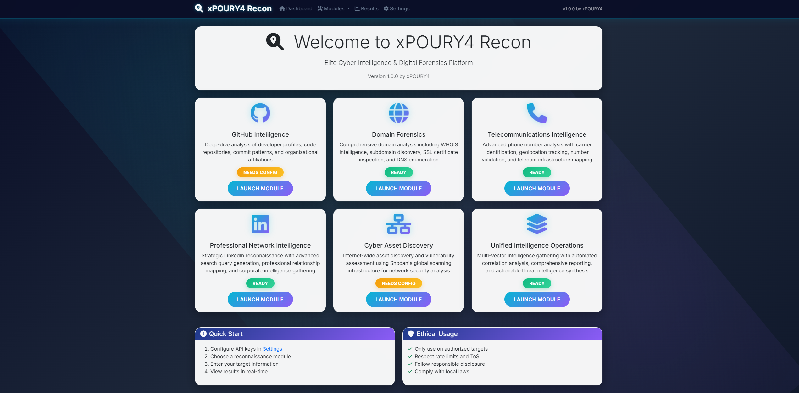
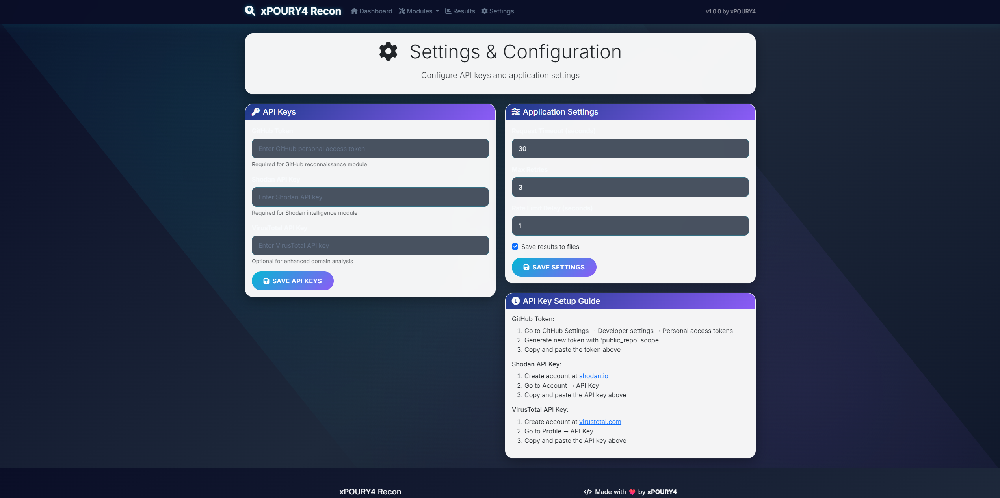

# xPOURY4 Recon - Elite Cyber Intelligence & Digital Forensics Platform

[](https://python.org)
[](LICENSE)
[](https://github.com/xPOURY4/xPOURY4-recon)

**xPOURY4 Recon** is a next-generation OSINT (Open Source Intelligence) framework engineered for cybersecurity professionals, digital investigators, and ethical hackers. This elite platform automates comprehensive intelligence gathering and correlation analysis across multiple attack vectors including GitHub, domains, telecommunications, professional networks, and global internet infrastructure.

## 📸 Screenshots

### 🌐 Web Dashboard

*Modern cybersecurity-themed dashboard with real-time intelligence modules*

### 🐙 GitHub Intelligence Module

*Deep-dive developer profiling and repository forensics*

### 🌍 Domain Forensics Module

*Comprehensive domain analysis and infrastructure mapping*

### 📱 Telecommunications Intelligence

*Advanced phone number analysis and carrier identification*

### 💼 Professional Network Intelligence

*Strategic LinkedIn reconnaissance and corporate intelligence*

### 🔍 Cyber Asset Discovery

*Internet-wide device enumeration and vulnerability assessment*

### ⚙️ Configuration Management

*Secure API key management and system configuration*

> **📸 Contributing Screenshots**: To add or update screenshots, please see the [screenshots directory](screenshots/README.md) for detailed guidelines and requirements.

## 🚀 Features

### Core Intelligence Modules
- **🐙 GitHub Intelligence**: Deep-dive developer profiling, repository forensics, and organizational mapping
- **🌐 Domain Forensics**: Advanced WHOIS intelligence, subdomain discovery, and infrastructure analysis
- **📱 Telecommunications Intelligence**: Carrier identification, geolocation tracking, and telecom infrastructure mapping
- **💼 Professional Network Intelligence**: Strategic LinkedIn reconnaissance and corporate intelligence gathering
- **🔍 Cyber Asset Discovery**: Internet-wide device enumeration, vulnerability assessment, and threat intelligence
- **🎯 Unified Intelligence Operations**: Multi-vector correlation analysis with automated threat intelligence synthesis

### Technical Features
- **⚡ Asynchronous Processing**: High-performance async/await implementation
- **🌐 Modern Web UI**: Beautiful, responsive web interface with real-time updates
- **📊 Advanced Logging**: Comprehensive logging system with multiple output formats
- **⚙️ Flexible Configuration**: YAML-based configuration with environment variable support
- **🔒 Security Focused**: Input validation, rate limiting, and secure API handling
- **📈 Performance Optimized**: Concurrent processing and intelligent caching

## 📦 Installation

### Prerequisites
- Python 3.8 or higher
- pip package manager

### Quick Installation

```bash
# Clone the repository
git clone https://github.com/xPOURY4/xPOURY4-recon.git
cd xPOURY4-recon

# Install dependencies
pip install -r requirements.txt

# Run the application
python main.py
```

### Development Installation

```bash
# Clone and setup development environment
git clone https://github.com/xPOURY4/xPOURY4-recon.git
cd xPOURY4-recon

# Create virtual environment
python -m venv venv
source venv/bin/activate  # On Windows: venv\Scripts\activate

# Install dependencies
pip install -r requirements.txt

# Install development dependencies
pip install -e .
```

## 🎯 Usage

### Command Line Interface

```bash
# Interactive CLI mode
python main.py

# Web interface mode
python main.py --web

# Show configuration
python main.py --config

# Show version
python main.py --version
```

### Web Interface

Launch the web interface for a modern, user-friendly experience:

```bash
python main.py --web
```

Then open your browser to `http://localhost:5000`

### CLI Examples

#### GitHub Reconnaissance
```bash
# Run GitHub investigation
python main.py
# Select option 1 and enter username
```

#### Domain Analysis
```bash
# Comprehensive domain investigation
python main.py
# Select option 2 and enter domain
```

#### Phone Number OSINT
```bash
# Phone number investigation
python main.py
# Select option 3 and enter phone number with country code
```

## ⚙️ Configuration

### API Keys Setup

Create a `config.yaml` file or set environment variables:

```yaml
api_keys:
  github_token: "your_github_token_here"
  shodan_api_key: "your_shodan_api_key_here"
  virustotal_api_key: "your_virustotal_api_key_here"

settings:
  timeout: 30
  max_retries: 3
  rate_limit_delay: 1.0
  save_results: true
  results_directory: "results"

web_ui:
  host: "127.0.0.1"
  port: 5000
  debug: false
```

### Environment Variables

```bash
export GITHUB_TOKEN="your_github_token"
export SHODAN_API_KEY="your_shodan_key"
export VIRUSTOTAL_API_KEY="your_virustotal_key"
```

## 🏗️ Project Structure

```
xPOURY4-recon/
├── xPOURY4_recon/
│   ├── core/
│   │   ├── __init__.py
│   │   ├── config_manager.py
│   │   ├── exceptions.py
│   │   ├── logger.py
│   │   └── recon_engine.py
│   ├── modules/
│   │   ├── __init__.py
│   │   ├── base_module.py
│   │   ├── github_recon.py
│   │   ├── domain_recon.py
│   │   ├── phone_recon.py
│   │   ├── linkedin_recon.py
│   │   └── shodan_recon.py
│   ├── web/
│   │   ├── __init__.py
│   │   ├── app.py
│   │   └── templates/
│   └── __init__.py
├── main.py
├── requirements.txt
├── config.yaml
└── README.md
```

## 🔧 API Integration

### GitHub API
- Requires personal access token
- Provides comprehensive user and repository data
- Includes organization and activity information

### Shodan API
- Network device and service discovery
- Vulnerability identification
- Geographic and ISP information

### VirusTotal API
- Domain reputation analysis
- Subdomain enumeration
- Malware and threat detection

## 📊 Output Formats

### JSON Results
```json
{
  "module": "github_recon",
  "timestamp": "2024-01-15T10:30:00",
  "success": true,
  "data": {
    "profile": {...},
    "repositories": [...],
    "statistics": {...}
  }
}
```

### Web Dashboard
- Real-time investigation progress
- Interactive result visualization
- Export capabilities
- Historical data tracking

## 🛡️ Security Considerations

### Ethical Usage
- **Only use on authorized targets**
- **Respect rate limits and terms of service**
- **Follow responsible disclosure practices**
- **Comply with local laws and regulations**

### Data Protection
- API keys are never logged or exposed
- Results can be automatically encrypted
- Configurable data retention policies
- Secure configuration management

## 🤝 Contributing

We welcome contributions! Please follow these guidelines:

1. Fork the repository
2. Create a feature branch (`git checkout -b feature/amazing-feature`)
3. Commit your changes (`git commit -m 'Add amazing feature'`)
4. Push to the branch (`git push origin feature/amazing-feature`)
5. Open a Pull Request

### Development Guidelines
- Follow PEP 8 style guidelines
- Add comprehensive docstrings
- Include unit tests for new features
- Update documentation as needed

## 📝 License

This project is licensed under the MIT License - see the [LICENSE](LICENSE) file for details.

## 🙏 Acknowledgments

- **Certificate Transparency Logs** for subdomain enumeration
- **ThreatCrowd** for threat intelligence data
- **Shodan** for network device discovery
- **GitHub API** for repository and user data
- **VirusTotal** for domain reputation analysis

## 📞 Support

- **Author**: xPOURY4
- **Email**: xpoury4@proton.me
- **GitHub**: [@xPOURY4](https://github.com/xPOURY4)

## 🔄 Version History

### v1.0.0 (Current)
- Complete xPOURY4 branding implementation
- Enhanced cybersecurity-focused UI with modern color scheme
- Improved module descriptions and professional terminology
- Elite cyber intelligence branding and messaging
- Advanced visual design with animated elements
- Professional forensics and intelligence capabilities
- Enhanced user experience with better typography
- Complete rewrite with modern architecture
- Asynchronous processing implementation
- Web UI with real-time updates
- Enhanced error handling and logging
- Modular design with plugin architecture
- Comprehensive configuration management

## ⚠️ Disclaimer

This tool is intended for educational and authorized testing purposes only. Users are responsible for complying with applicable laws and regulations. The authors are not responsible for any misuse or damage caused by this tool.

---

**Made with ❤️ by xPOURY4**